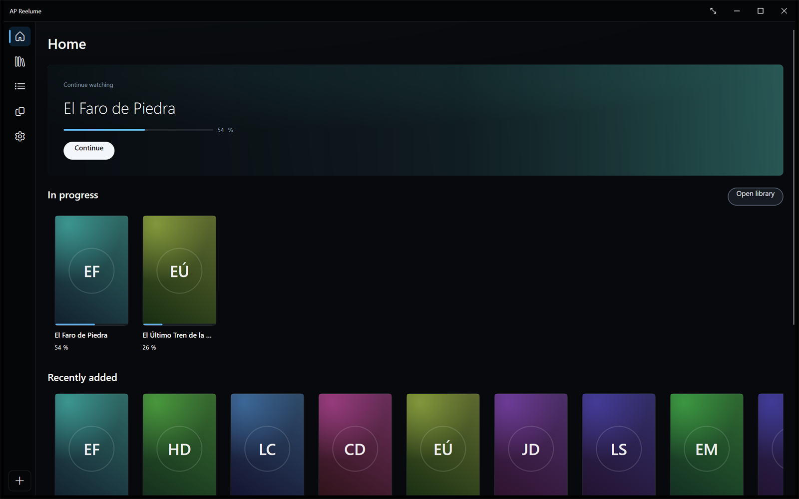
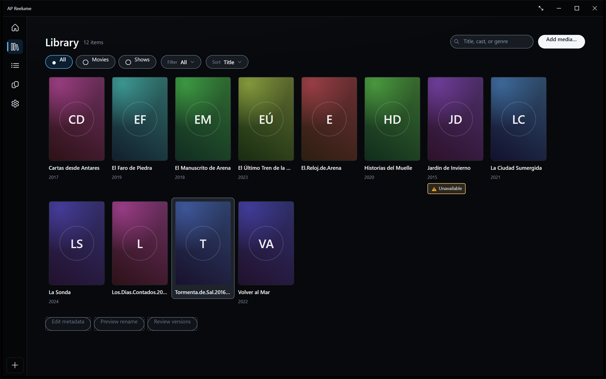
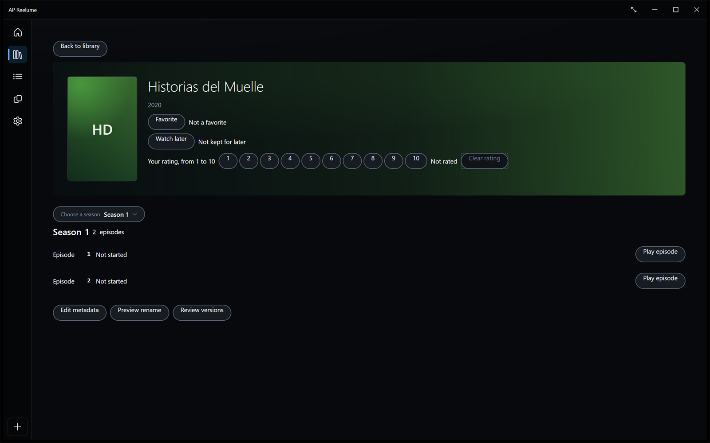
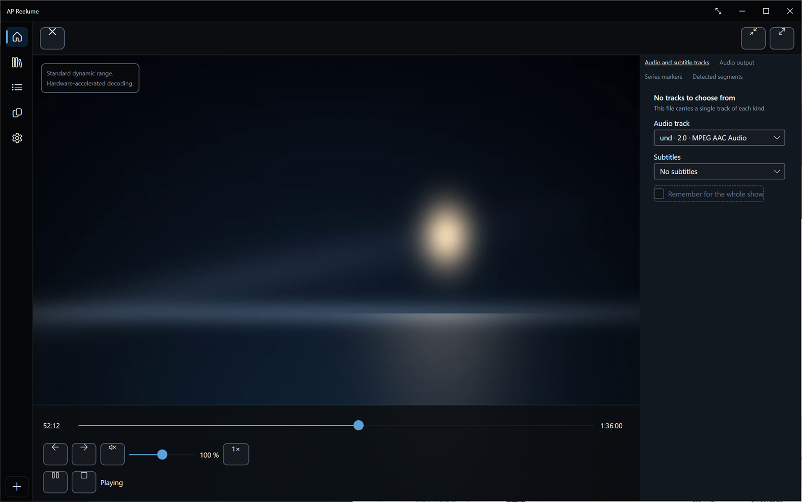
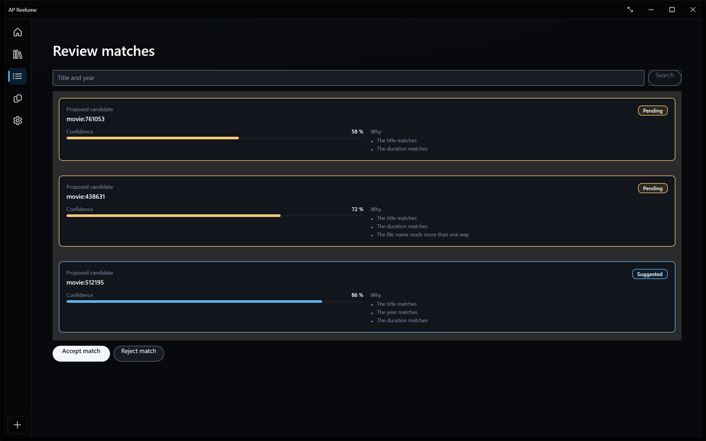

# AP Reelume

Una biblioteca de vídeo local y su reproductor, para Windows 11 x64. Cataloga los vídeos **donde
están**, los identifica, los reproduce y recuerda dónde se quedó. Sin cuenta, sin suscripción y sin
enviar nada a ninguna parte.

*Read this in [English](README.en.md).*

**Windows 11 x64** · **GPL-3.0-or-later** · [Descargar la última versión](https://github.com/apvisualsolutions/ap-reelume/releases/latest)

Todo commit que llega a `main` ha pasado [la verificación
completa](https://github.com/apvisualsolutions/ap-reelume/actions/workflows/ci.yml) en un ejecutor
hospedado: formato, compilación, la suite entera, las puertas de accesibilidad y de recuperación por
partida doble, el empaquetado y los suelos de cobertura. Arriba no hay insignia de estado a
propósito: el flujo corre sobre la rama de trabajo y `main` recibe ese mismo commit por avance
rápido, así que una insignia apuntando a `main` se congelaría en lo último que vio y seguiría
diciéndolo.

## Qué es

Una persona, un PC, sus archivos. AP Reelume lee las carpetas que usted le indica —locales, USB o
NAS por UNC— y construye un catálogo a partir de ellas. **Nunca copia ni mueve un vídeo** para
catalogarlo.

- **Biblioteca.** Escaneo inicial, al iniciar, manual e incremental, cancelable y reanudable, sobre
  10.000 archivos sin bloquear la interfaz.
- **Identificación.** Detecta película, serie, temporada y episodio por nombre y carpeta, y consulta
  TMDB en español con idioma alternativo. Lo dudoso va a una bandeja de revisión en lugar de
  clasificarse solo.
- **Reproducción.** LibVLC integrado, con apertura externa como alternativa. Contenedores y códecs
  habituales, incluidos H.264, HEVC y AV1; HDR10 con conversión de tono a SDR cuando la pantalla no
  lo admite.
- **Continuidad.** Guarda el progreso cada cinco segundos y en pausa, búsqueda y cierre; reanuda
  dentro de ±5 s incluso tras un cierre inesperado.
- **Suyo.** Favoritos, ver más tarde, valoración y recomendaciones locales que se explican y se
  pueden desactivar.

## Qué aspecto tiene

La biblioteca de estas capturas es **sembrada y ficticia**, y eso es una regla antes que una
comodidad: una captura de una biblioteca real lleva dentro los títulos y las rutas de alguien, en un
PNG que ninguna prueba puede leer, así que se toman de una ejecución con su propia raíz de datos
sobre películas inventadas. Las toma un guion contra la aplicación compilada, que es lo que permite
rehacerlas en el commit que cambia una vista.

La ficha de una serie: el selector de temporada, los episodios debajo y las acciones personales que
son de la serie entera.

La reproducción, con la columna de pistas abierta. La barra dice dónde va la sesión; al cerrar la
ventana y volver a abrirla se reanuda dentro de cinco segundos de ahí.

Lo que la identificación no pudo resolver espera aquí en vez de decidirse solo, y cada propuesta dice
por qué se propone.

## Qué no es

No hay cuentas, ni sincronización, ni nube. No convierte ni edita vídeo. No reproduce varios a la
vez. La lista completa, con sus identificadores, está en la
[hoja de ruta](docs/roadmap/README.es.md).

## Privacidad

Cero telemetría sin consentimiento, y el consentimiento es reversible. La identificación remota sólo
funciona si usted pone un token de TMDB a mano en `AP_LOCALMEDIA_TMDB_TOKEN`: **el artefacto no lleva
ninguno**, así que sin ese acto deliberado la aplicación no abre ninguna conexión de metadatos. El
comprobador de actualizaciones es la otra conexión posible, también bajo su control y desactivado de
fábrica; la tabla completa de destinos está en la declaración de privacidad. Los diagnósticos
son opt-in, se sanitizan y retirar el consentimiento borra el informe.

El detalle está en la [declaración de privacidad](docs/privacy/PRIVACY.es.md).

## Instalación

Descargue el ZIP de la publicación, descomprímalo donde quiera y ejecute
`ApSolutions.LocalMedia.Windows.exe`. No requiere instalación, ni permisos de administrador, ni
escribe en el registro.

**Windows mostrará un aviso de SmartScreen.** Es correcto: esta publicación **no está firmada**, y no
afirmamos lo contrario. Qué comprobar en su lugar —el hash publicado y la compilación reproducible—
está en [SMARTSCREEN.es.md](docs/release/SMARTSCREEN.es.md).

Sus datos van a `%LOCALAPPDATA%\APSolutions\LocalMedia`, salvo que nombre otra carpeta con
`AP_LOCALMEDIA_DATA_ROOT`. Para desinstalar, borre la carpeta que descomprimió; sus datos siguen
donde estaban.

## Documentación

| | |
|---|---|
| [Manual de uso](docs/user-guide/README.es.md) | Cómo hacer cada cosa |
| [Solución de problemas](docs/troubleshooting/README.es.md) | Qué hacer cuando algo no va |
| [Hoja de ruta](docs/roadmap/README.es.md) | Qué viene y qué no se hará |
| [Matriz de funcionalidades](docs/FEATURES.md) | El registro canónico del alcance |
| [Privacidad](docs/privacy/PRIVACY.es.md) | Qué se guarda y qué no sale de aquí |
| [Estado legal](docs/legal/LEGAL.es.md) | Licencia, terceros y qué sigue abierto |
| [Cambios](docs/CHANGELOG.es.md) | Qué cambió en cada versión |
| [Guía de desarrollo](docs/development/README.es.md) | Cómo compilar y verificar |
| [Publicación](docs/release/RELEASING.es.md) | Cómo se corta una versión |
| [Decisiones](docs/adr) | Por qué el proyecto es como es |

## Licencia

GPL-3.0-or-later. Vea [LICENSE](LICENSE), [NOTICE](NOTICE) y los
[avisos de terceros](docs/release/THIRD-PARTY-NOTICES.es.md). Este producto usa TMDB y las API de
TMDB, pero no está avalado, certificado ni aprobado de ningún otro modo por TMDB.

El programa se entrega **sin garantía alguna**, en la medida en que lo permita la ley aplicable:
véanse las secciones 15 a 17 de la [licencia](LICENSE). Los límites jurídicos que siguen abiertos
—entre ellos el dictamen profesional de `REL-004`— están nombrados en
[el estado legal](docs/legal/LEGAL.es.md).
